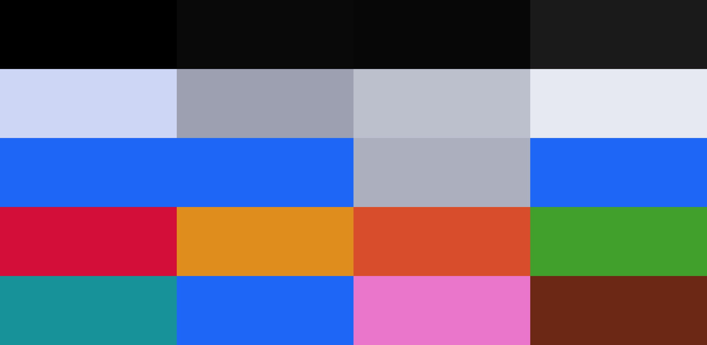
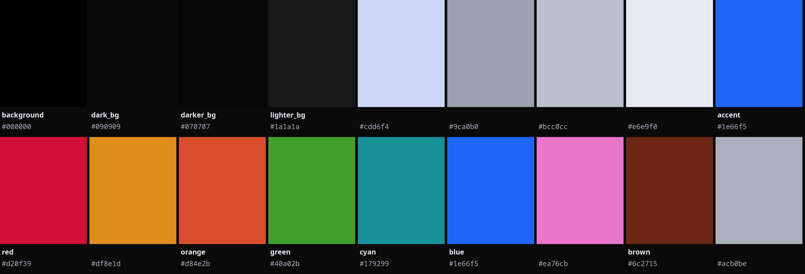

# Synctax — a theme by [pxllbt](https://github.com/pxllbt)

[](https://omarchy.org/themes)
[](LICENSE)
[](https://github.com/pxllbt/synctax/stars)
[](https://github.com/pxllbt/synctax/releases)
[](https://github.com/pxllbt/synctax/pulls)

> **pxllbt's Synctax — a true-black Omarchy theme with one electric blue accent**

[Preview](#preview) · [Install](#install) · [Palette](#palette) · [Backgrounds](#background) · [License](#license)

A personal Omarchy theme built on a pitch-black foundation with a carefully
adapted pastel palette. `#000000` surfaces, near-white text, and a single
electric blue accent (`#1e66f5`) across the window border, selection, and
active elements. Eight semantic accent colors cover errors, warnings,
success, links, and more.

## Preview





## Install

```bash
omarchy theme install https://github.com/pxllbt/synctax
omarchy theme set synctax
```

Or use *Install > Style > Theme* in the Omarchy menu, then select **Synctax**
under *Style > Theme* (`Super + Ctrl + Shift + Space`).

Requires Omarchy 4 for semantic palette support.

## Palette

| Key | Value | Role |
| --- | ----- | ---- |
| `background` | `#000000` | pure black |
| `dark_background` | `#090909` | surface |
| `darker_background` | `#070707` | deep surface |
| `lighter_background` | `#1a1a1a` | raised surface |
| `foreground` | `#cdd6f4` | text |
| `dark_foreground` | `#9ca0b0` | subtext |
| `light_foreground` | `#bcc0cc` | text |
| `bright_foreground` | `#e6e9f0` | headings |
| `accent` | `#1e66f5` | electric blue |
| `selection` | `#1e66f5` | selection |
| `muted` | `#acb0be` | overlay |
| `red` | `#d20f39` | coral — errors |
| `yellow` | `#df8e1d` | amber — warnings |
| `orange` | `#d84e2b` | peach |
| `green` | `#40a02b` | emerald — success |
| `cyan` | `#179299` | teal |
| `blue` | `#1e66f5` | electric — links |
| `magenta` | `#ea76cb` | pink |
| `brown` | `#6c2715` | maroon |

## Background

Three wallpapers ship with the theme. Cycle them with `omarchy theme bg next`:

| File | Resolution | Description |
| --- | --- | --- |
| `backgrounds/gradient.jpg` | 5640×2400 | Dark blue gradient field, deep navy to light blue |
| `backgrounds/void.png` | 1920×1080 | Near-black background with subtle gray accents |
| `backgrounds/nebula.png` | 1920×1080 | Deep blue gradient with lighter blue highlights |

## License

MIT — see [LICENSE](LICENSE).

---

By [pxllbt](https://github.com/pxllbt). Part of the [Omarchy](https://omarchy.org) community themes.
